* Korean (this)
* [English](README_en.md)

# 이게 뭐임?
블루 아카이브 한섭 및 글로벌 서버 3주년 기념 특별 웹 리듬게임의 채보.

[https://bluearchive.nexon.com/events/2024/10/minigame](https://bluearchive.nexon.com/events/2024/10/minigame)

# 파일 설명
* chartgen.py: 노트 데이터를 한 장의 이미지로 생성
* charsplit.py: charget에서 생성한 이미지를 분할 후 가로로 병합
* extract_data.py: json/original.js 파일에서 각 노트 데이터 분리. 필요 없음.
* note_counter.py: 노트 개수 세는 스크립트. 필요 없음.

# 노트가 그려지는 방식
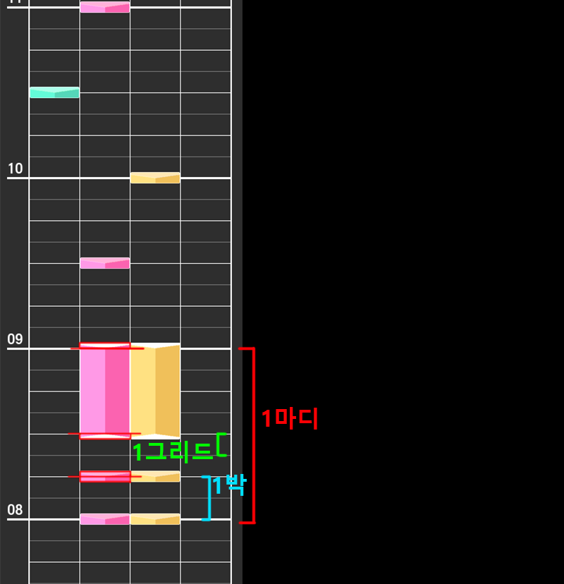

임의로 4박을 1마디로 정하고 그렸음. 1박자는 그리드라는 단위로 나뉘는데, 같은 박자에 있는 노트라도 박자당 그리드(gridsPerBeat)가 다를 수 있음.
노트는 자신의 박자가 시작되는 y좌표로부터 1박자당 높이를 자신의 gridsPerBeat로 나눈 다음, 그 값으로 자신의 grid에 해당하는 위치를 계산한다.

노트는 자신이 위차할 y좌표를 기준으로 일반 노트는 중앙 정렬, 롱노트 시작 부분은 상단 정렬, 롱노트 종료 부분은 하단 정렬된다.
(사진의 빨간색 표시)

보라색 노트는 피버 노트로 피버 게이지가 찼을 때 원래 색 대신 보라색으로 바뀌어 나오는 노트들이다.

※ 그리드가 세분화 되면 노트의 y 좌표가 부정확해지는 문제가 있지만 채보를 보는데에는 지장이 없을 정도의 값이라 따로 수정할 예정은 없음.

# 완성본
스크립트로 기본적인 채보를 뽑아내고 추가로 포토샵으로 배치를 하였음.

## After School Dessert
### EASY
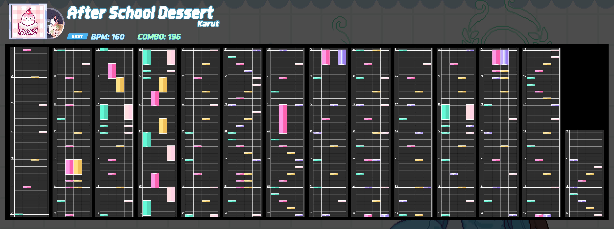
### NORMAL
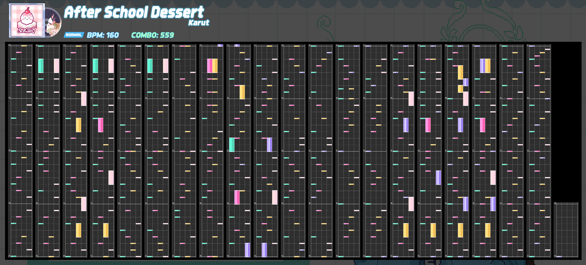
### HARD
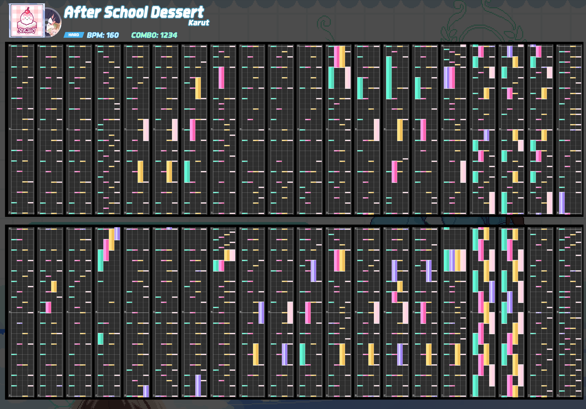

## Aoharu
### EASY
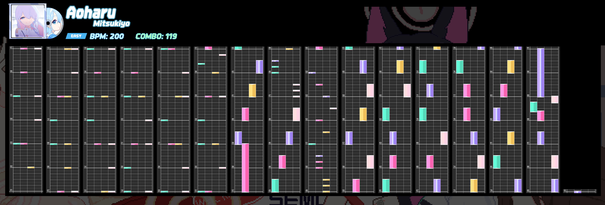
### NORMAL
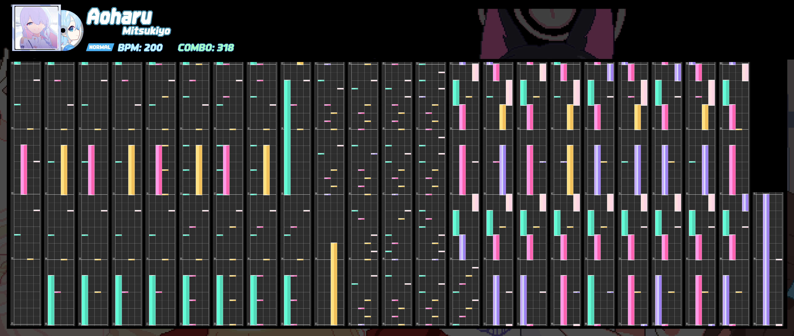
### HARD
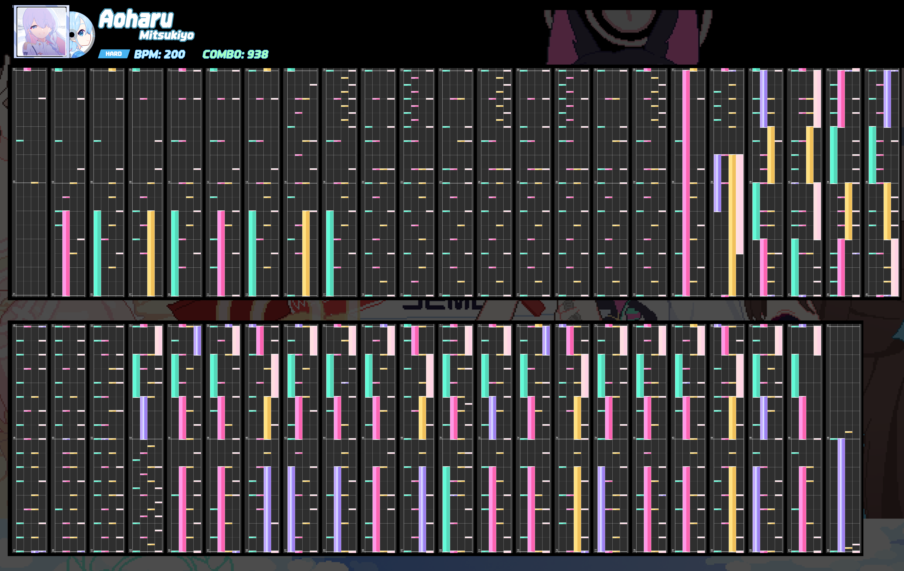

## Bluemark Canvas
### EASY
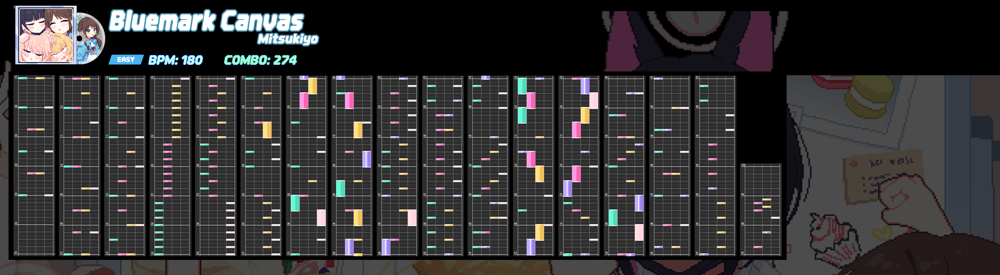
### NORMAL
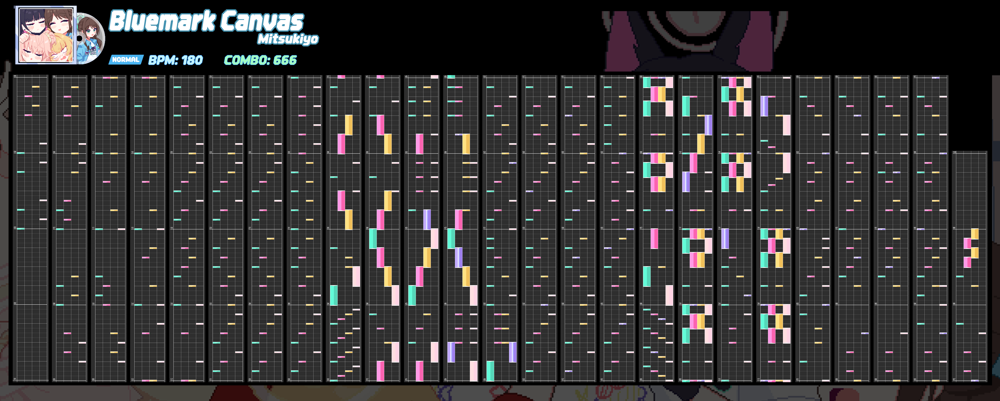
### HARD
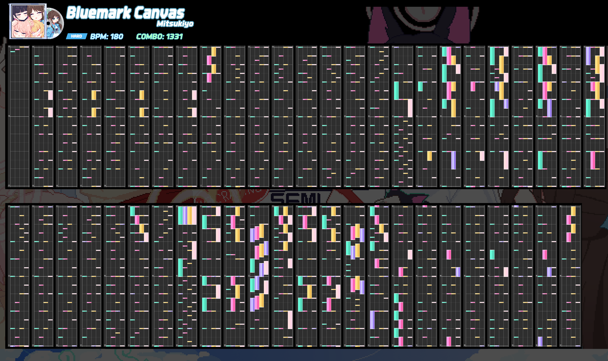

## Irodori Canvas
### EASY
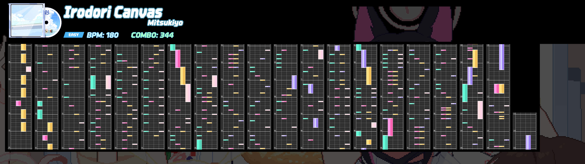
### NORMAL
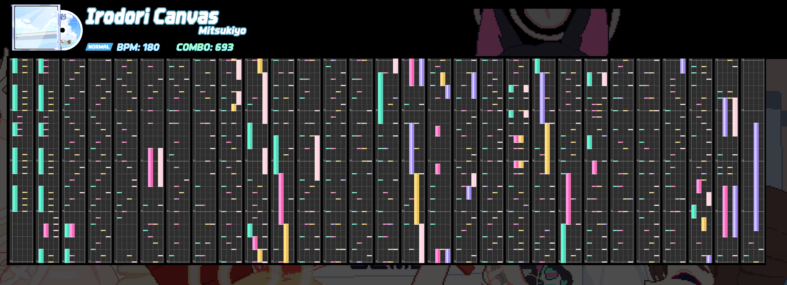
### HARD
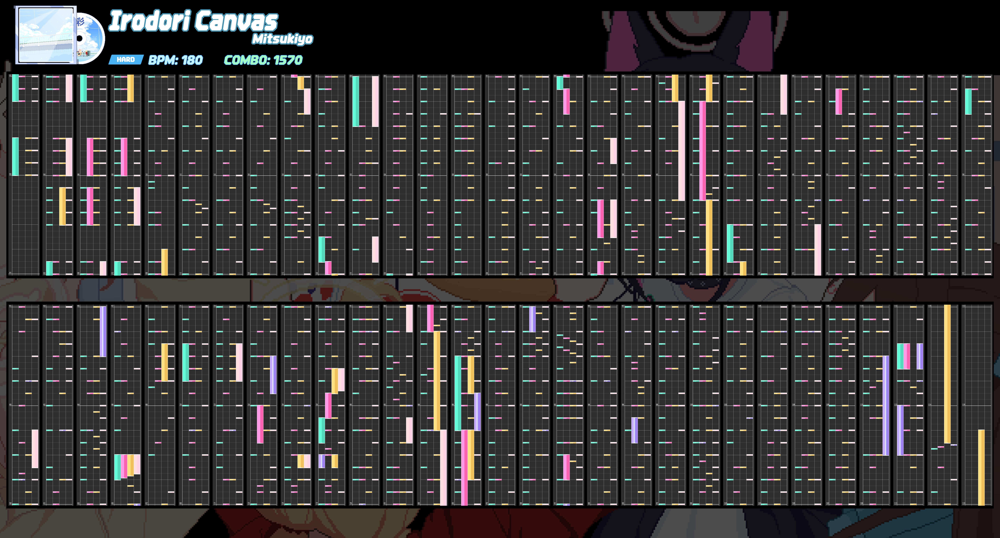