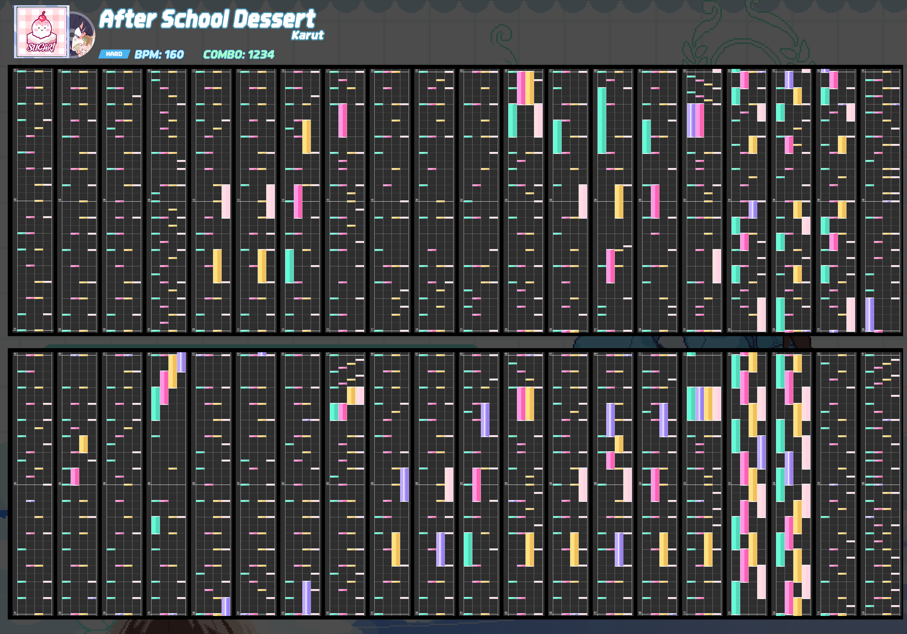
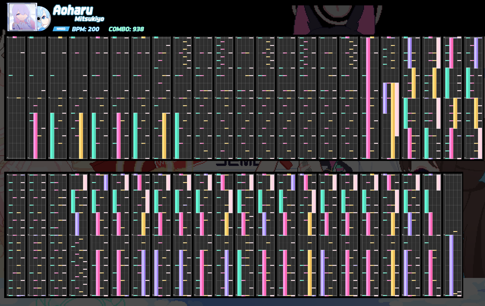
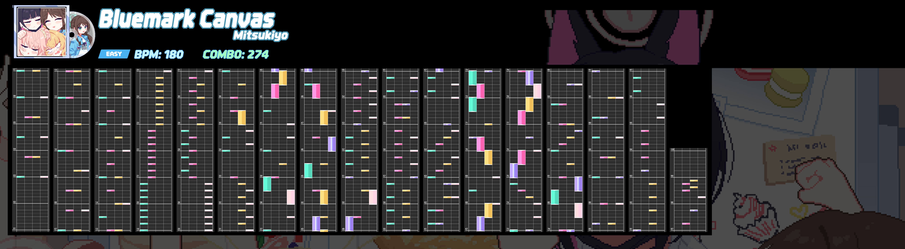
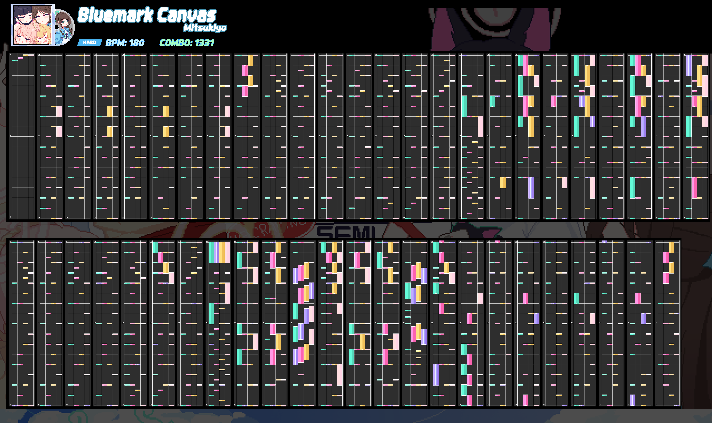
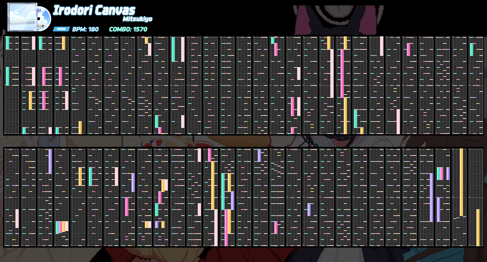

* [Korean](README.md)
* English (this)

# What is this?
This is the chart for a special web rhythm game created to celebrate the 3rd anniversary of Blue Archive's KR and Global servers.

[https://bluearchive.nexon.com/events/2024/10/minigame](https://bluearchive.nexon.com/events/2024/10/minigame)

# File Description
* chartgen.py: Generates note data into a single image.
* charsplit.py: Splits the image generated by chartgen and merges it horizontally.
* extract_data.py: Separates note data from json/original.js. Not needed.
* note_counter.py: Script for counting notes. Not needed.

# How Notes Are Drawn

Red: 1 bar  
Green: 1 grid  
Blue: 1 beat

The system arbitrarily sets 4 beats as one measure. Each beat is divided into units called grids, and even if the notes are on the same beat, the grids per beat (gridsPerBeat) can vary.
The notes calculate their position in the grid by dividing the height per beat by their own gridsPerBeat from the y-coordinate where their beat starts.

Notes are aligned differently based on their y-coordinate: regular notes are center-aligned, the start of long notes is top-aligned, and the end of long notes is bottom-aligned.
(As indicated by the red marks in the image)

Purple notes are fever notes, which appear purple instead of their original color when the fever gauge is filled.

※ When the grid is subdivided, there is an issue where the y-coordinate of the notes becomes inaccurate, but the value is not significant enough to affect viewing the chart, so there are no plans to fix it.

# Final Version
The basic chart was generated with scripts and further arranged using Photoshop.

## After School Dessert
### EASY

### NORMAL

### HARD

## Aoharu
### EASY

### NORMAL

### HARD

## Bluemark Canvas
### EASY

### NORMAL

### HARD

## Irodori Canvas
### EASY

### NORMAL

### HARD

